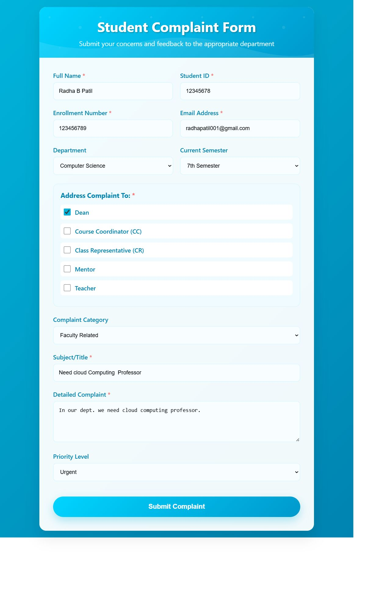
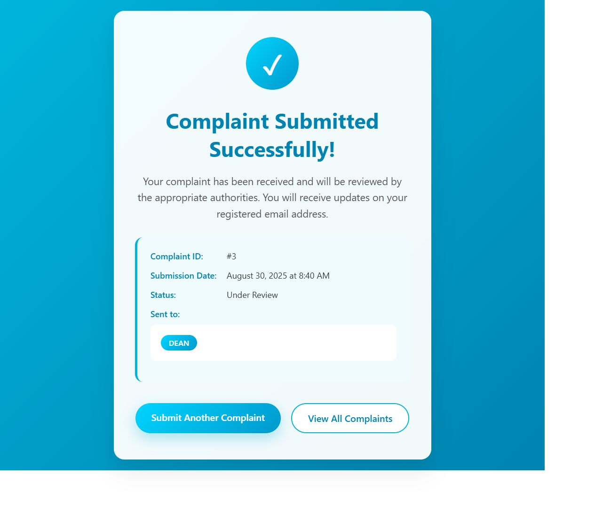
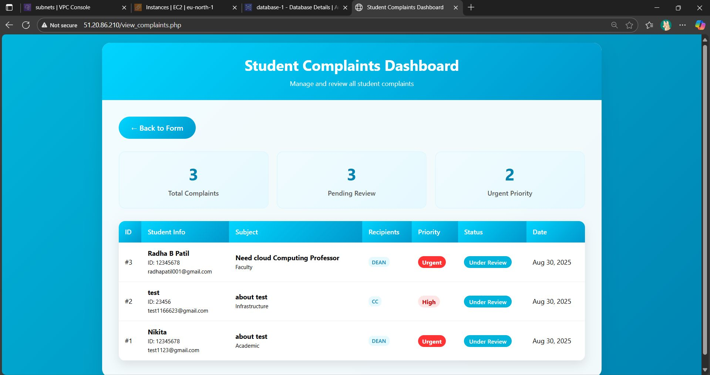
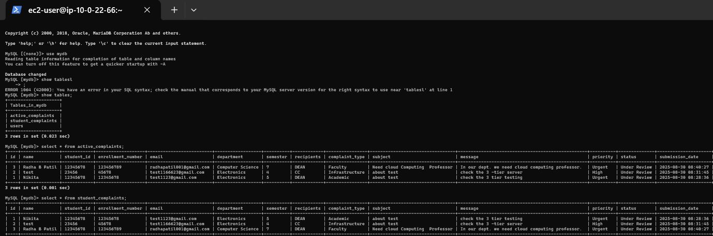

📚 Student Complaint Portal

A secure and scalable Student Complaint Management System hosted on AWS using VPC architecture. This project helps students register complaints online, which are stored in a database and can be viewed by the admin.

 
 🏗️ Project Architecture

 
  
   
    
 

The system is deployed in a 3-tier VPC setup:
VPC → Custom VPC with multiple subnets.
Public Subnet → Hosts the Web Server (serves HTML, CSS files).
Private Subnet → Hosts the App Server (PHP backend handling logic).
Database Subnet → AWS RDS MySQL instance (stores complaints securely). 

 
🔹 File Structure

student-complaint-portal/
│
├── /web-server
│   ├── index.html
│   ├── complaint_form.html
│   └── styles.css
│
├── /app-server
│   ├── submit_complaint.php
│   ├── view_complaints.php
│   └── db_config.php
│
└── /database
    └── AWS RDS instance (MySQL)
 
 
⚡ Features

✅ Student can submit complaints online.
✅ Admin can view all submitted complaints.
✅ Secure communication using VPC with public & private subnets.
✅ Database hosted on AWS RDS (MySQL) for reliability & scalability.
✅ Separation of concerns: HTML/CSS → Web Server, PHP → App Server, Data → RDS.

 
Content created using ChatGPT
ChatGPT said:

 
✅ Student can submit complaints online.
✅ Admin can view all submitted complaints.
✅ Secure communication using VPC with public & private subnets.
✅ Database hosted on AWS RDS (MySQL) for reliability & scalability.
✅ Separation of concerns: HTML/CSS → Web Server, PHP → App Server, Data → RDS.
 

 
🚀 Setup & Installation
1️⃣ Clone the Repository
git clone https://github.com/your-username/student-complaint-portal.git
cd student-complaint-portal

 
 
2️⃣ Web Server Setup (Public Subnet)
Deploy the contents of /web-server into your web server (e.g., Apache, Nginx).
Ensure HTTP/HTTPS access is allowed in the Security Group.
sudo cp -r web-server/* /var/www/html/
 
 
3️⃣ App Server Setup (Private Subnet)
Deploy PHP files from /app-server into the app server.
Update db_config.php with your RDS credentials:
 
 
<?php
$servername = "your-rds-endpoint.amazonaws.com";
$endpoint = "your-rds-endpoint.amazonaws.com";
$username   = "admin";
$password   = "yourpassword";
$dbname     = "complaints_db";
?>

 
 
4️⃣ Database Setup (AWS RDS)

Launch an RDS MySQL instance in a private subnet.

Create a database:

CREATE DATABASE complaints_db;
USE complaints_db;

CREATE TABLE complaints (
    id INT AUTO_INCREMENT PRIMARY KEY,
    student_name VARCHAR(100) NOT NULL,
    complaint_text TEXT NOT NULL,
    submitted_at TIMESTAMP DEFAULT CURRENT_TIMESTAMP
);

 
 
🌐 Deployment
Web Server → Public Subnet (Accessible via browser).
App Server → Private Subnet (Handles PHP logic).
RDS MySQL → Database Subnet (Accessible only by App Server).
 

 
📌 Future Improvements
Add authentication for Admin.
Enable Email notifications for complaint submissions.
Implement API endpoints for mobile app integration.
 
 
📝 Author

👤 Nikita Thosare 

linkin Profile:  www.linkedin.com/in/nikita-thosare-b9b8072a5
 
